Meus Dados
===========================

.. meta::
   :description: Visualizar suas informações presente no sistema.

Para acessar as informações pessoais no SAIP, basta clicar na opção **Meus Dados** no menu lateral esquerdo.

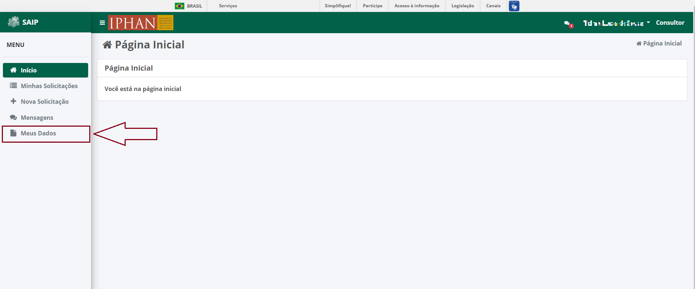

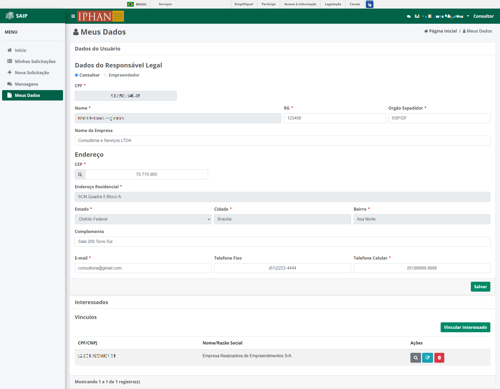

Dados do Usuário
----------------------------

Em **Dados do Usuário**, poderá ser realizada a atualização dos seus dados como: RG, Órgão Expedidor, Nome da Empresa, Endereço, E-mail e Telefone. Apenas o CPF e o Nome não podem ser alterados. 

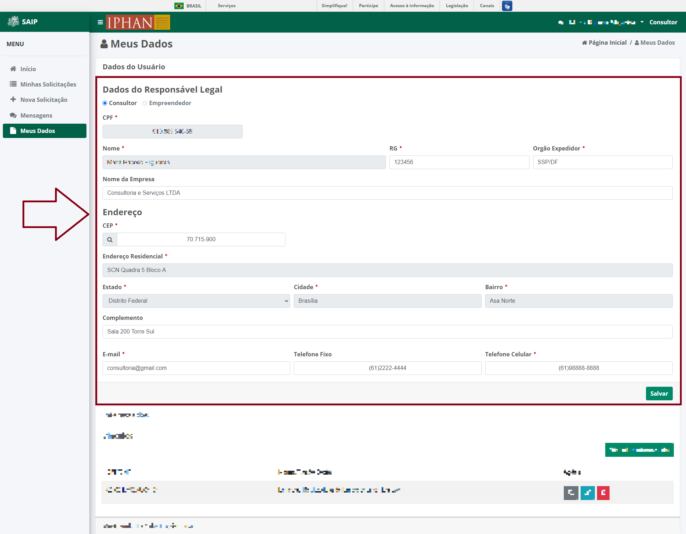

.. note:: 
    Sempre que realizar alterações, clicar no botão **Salvar** para que a solicitação seja executada.

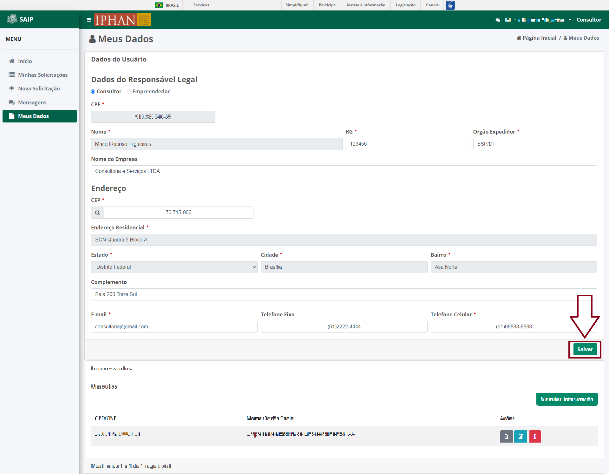

Interessados - Vínculos
----------------------------

Em **Interessados - Vínculos**, o sistema listará todas as pessoas/empresas que são vinculadas ao seu usuário. 

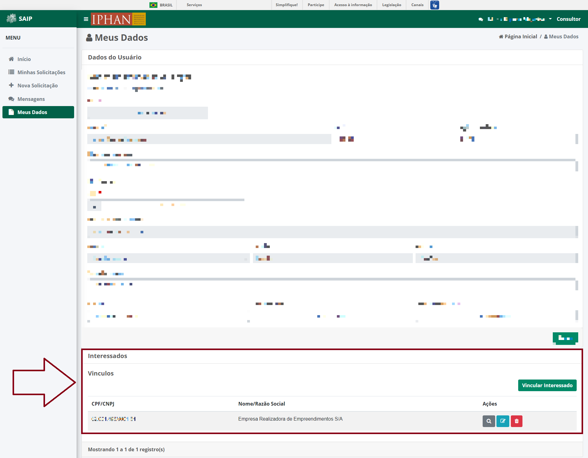

Na lista, há as ações de **Detalhar Interessado**, **Editar Interessado** e **Excluir Interessado**.

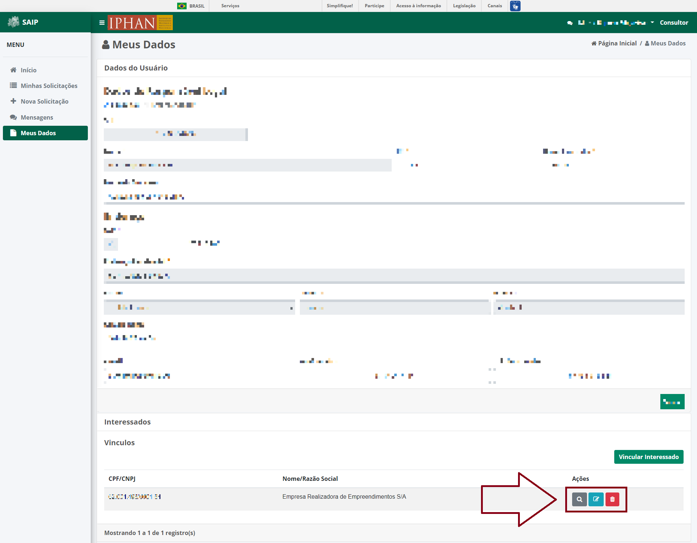

* Visualizar Interessado

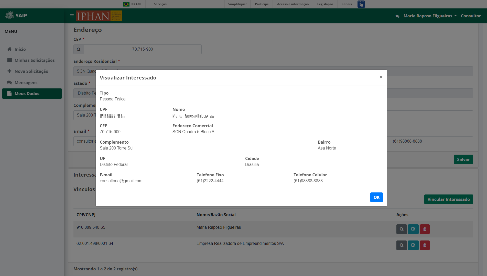

* Excluir Interessado

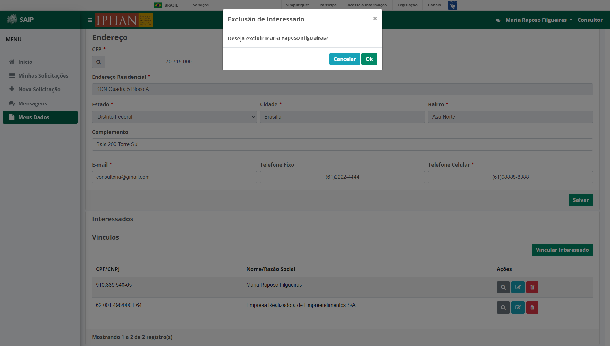

Para realizar a sua vinculação a um Interessado, deverá ser acionado o botão **Vincular Interessado**.

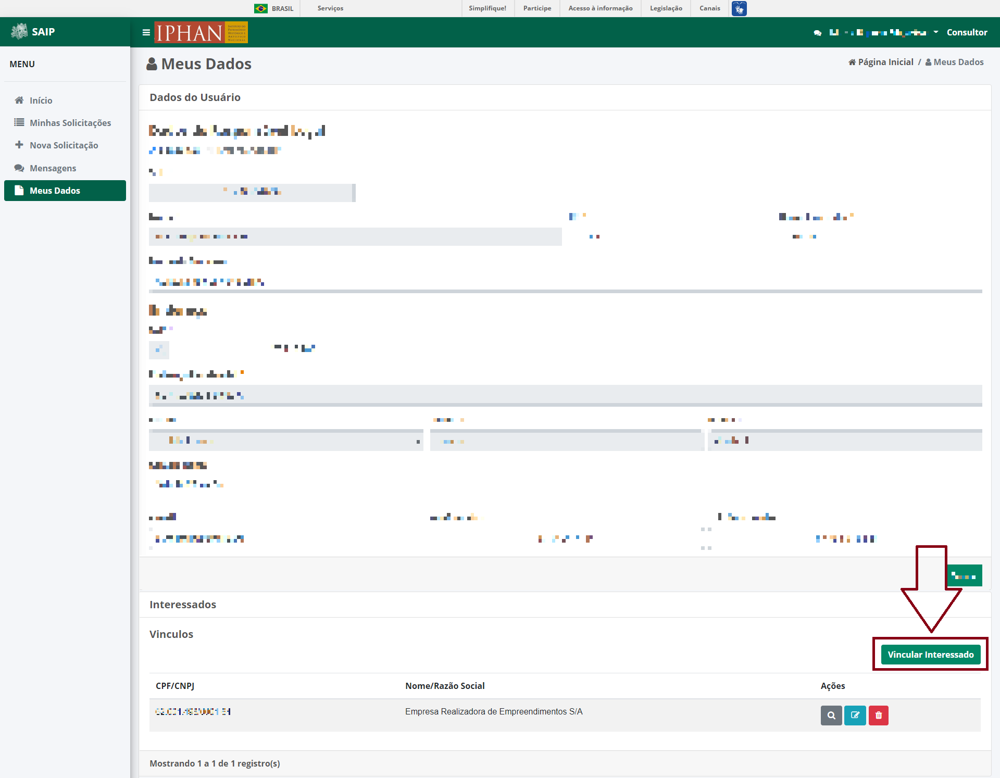

Deverá ser escolhido se o Interessado é Pessoa Física ou Pessoa Jurídica e em seguida, o sistema apresenta um formulário adequado para cada tipo.

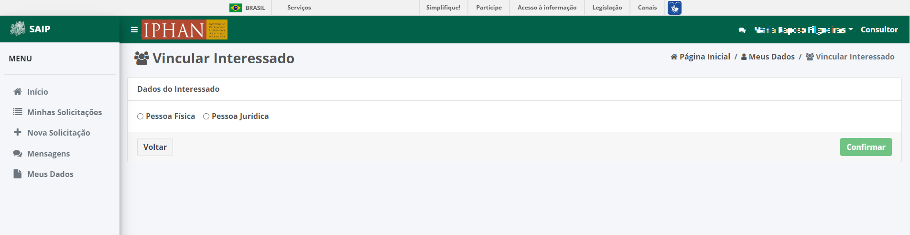

Pessoa Física
^^^^^^^^^^^^^^^^

Ao selecionar Pessoa Física, preencher as informações de CPF, Nome, CEP, Complemento, E-mail e Telefone. Em seguida, o texto da auto declaração será apresentado, caso concorde marque a caixa ao lado para então acionar o botão **Confirmar**.

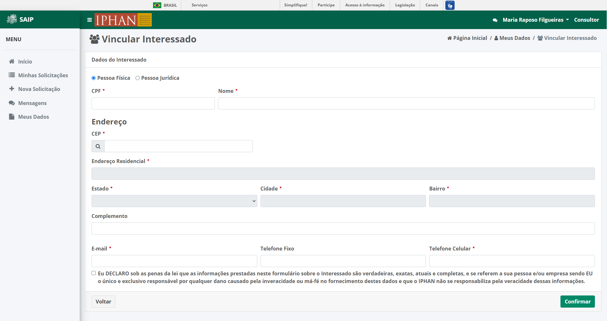

.. note:: 

   Ao informar o CPF e o sistema encontre um registro correspondente na base, o nome é preenchido automaticamente.

.. note:: 

   Para pesquisar o seu endereço, insira o CEP correspondente e clique na lupa ao lado esquerdo do campo ou aperte a tecla **Tab** no seu teclado, que o sistema pesquisa o endereço, conforme o CEP informado. Caso o sistema, não encontre os dados para o respectivo CEP é permitido que seja inserido o endereço de forma manual.

Os campos que possuem um asterisco em vermelho (:red:`*`) ao lado, são de preenchimento obrigatório. E caso os campos fiquem vazios, o sistema apresenta uma mensagem informando da obrigatoriedade da inserção das informações, conforme exemplo abaixo:

.. image:: ../images/DadosComplementares-Usuario-Validacao-Campo.png
   :alt: Dados Complementares Usuario Validacao Campo

Pessoa Jurídica
^^^^^^^^^^^^^^^^^^

Ao selecionar Pessoa Jurídica, preencher o CNPJ para ser consultado em nossa base de dados.

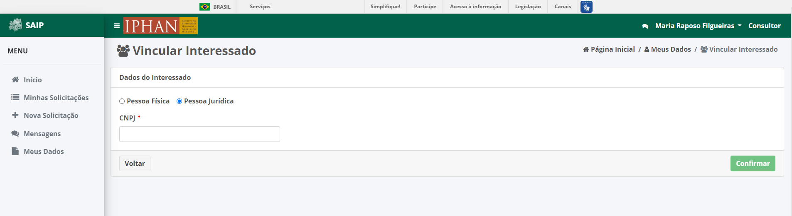

Após informar o CNPJ, o sistema apresenta o formulário, que deverá ser preenchido a Razão Social, Porte da Empresa, Representante, Endereço, E-mail e Telefone.  Por fim, deverá ser lido o texto da auto declaração e caso concorde, marque a caixa ao lado para então acionar o botão **Confirmar**.

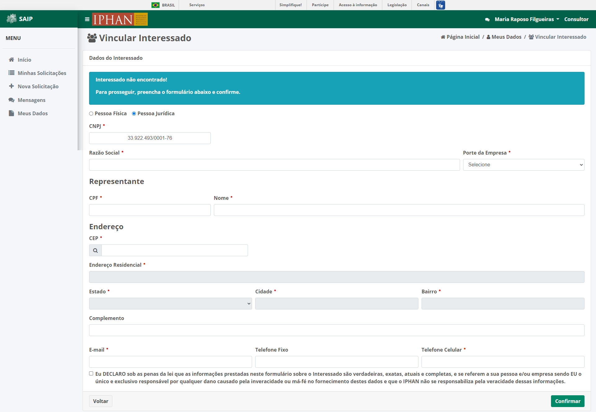

.. note:: 

   Ao informar o CNPJ e o sistema encontre um registro correspondente na base, a Razão Social será preenchida automaticamente.

.. note:: 

   Para pesquisar o seu endereço, insira o CEP correspondente e clique na lupa ao lado esquerdo do campo ou aperte a tecla **Tab** no seu teclado que o sistema pesquisa o endereço, conforme o CEP informado. Caso o sistema, não encontre os dados para o respectivo CEP é permitido que seja inserido o endereço de forma manual. 
   
Os campos que possuem um asterisco em vermelho (:red:`*`) ao lado, são de preenchimento obrigatório. E caso os campos fiquem vazios, o sistema apresenta uma mensagem informando da obrigatoriedade da inserção das informações, conforme exemplo abaixo:

.. image:: ../images/DadosComplementares-Usuario-Validacao-Campo.png
   :alt: Dados Complementares Usuario Validacao Campo