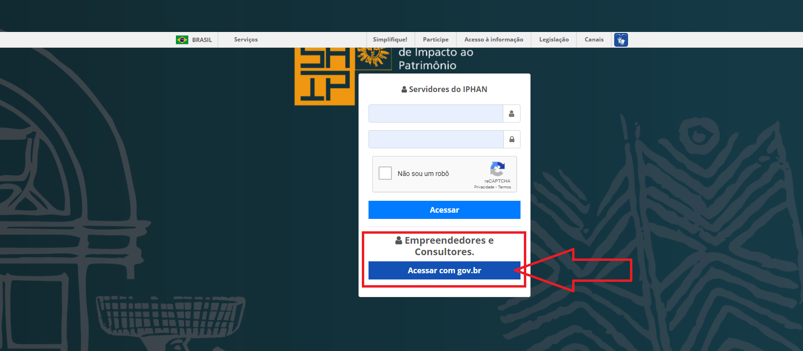
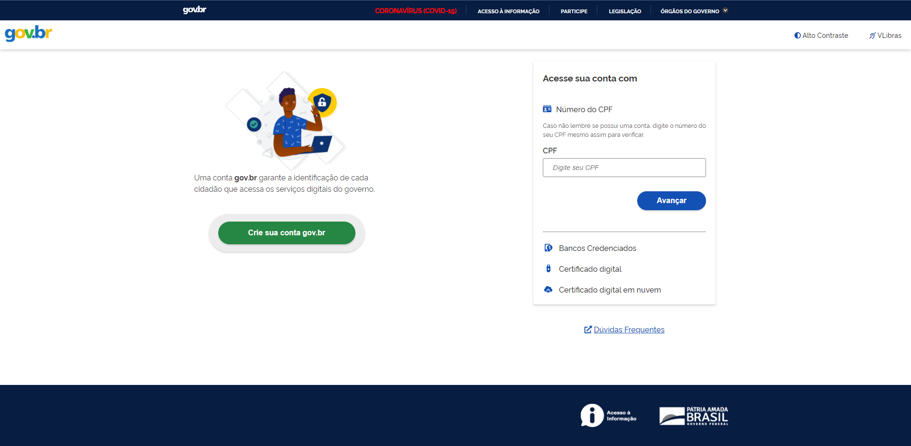
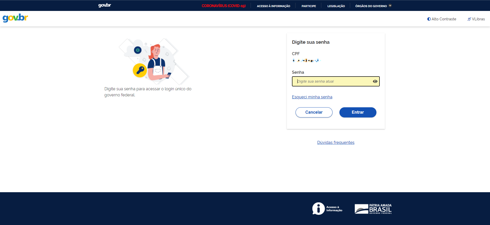
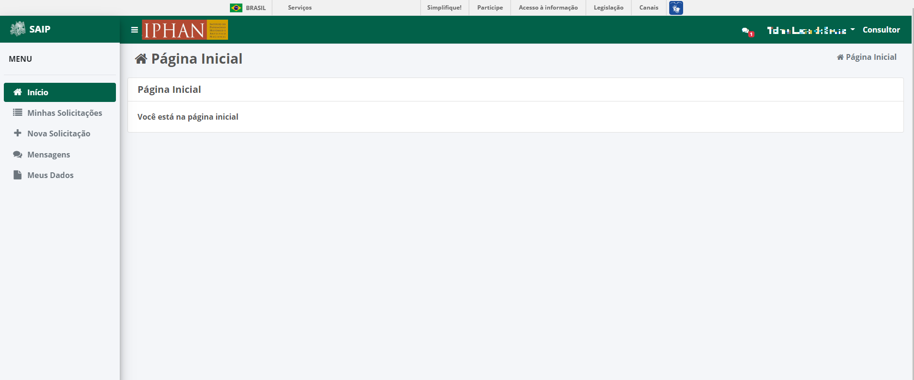

Login
===========================

.. meta::
   :description lang=pt_BR: Como realizar login no SAIP.

Para acessar o sistema o SAIP, digite a seguinte URL no navegador: https://www.saip.iphan.gov.br

Após ser apresentada a tela de login, clique na opção **Acessar com gov.br**. Então realize o login na plataforma **gov.br** e você será redirecionado para a tela inicial do SAIP.

