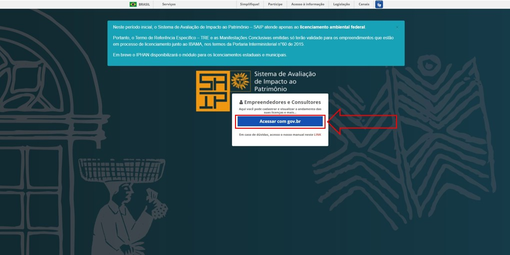
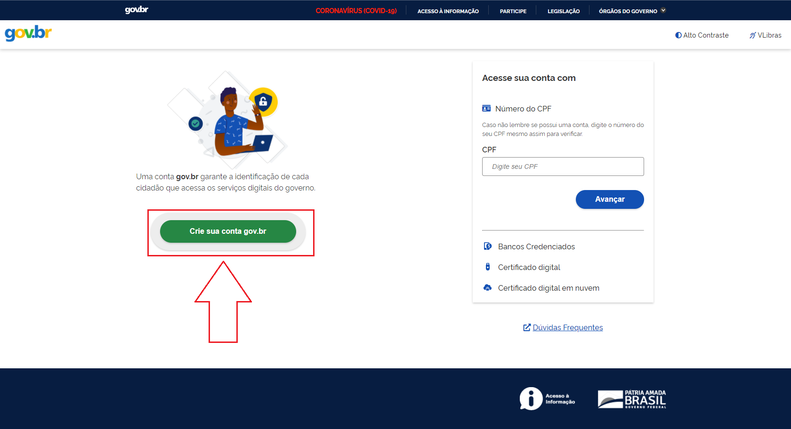
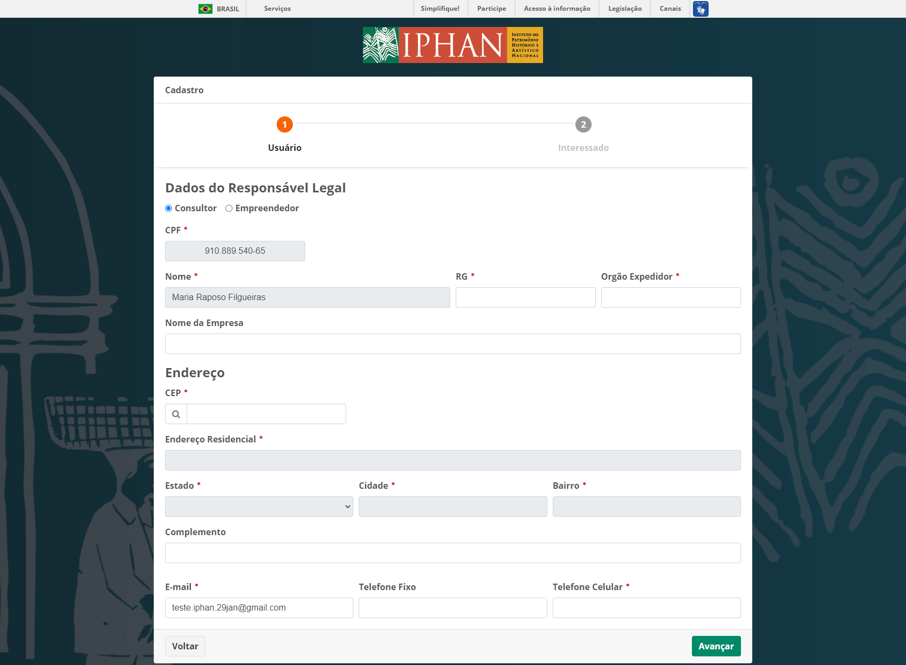
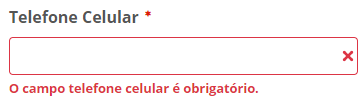
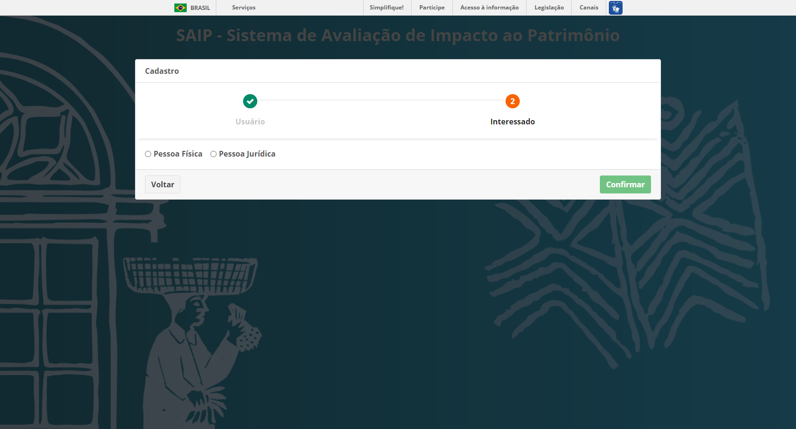
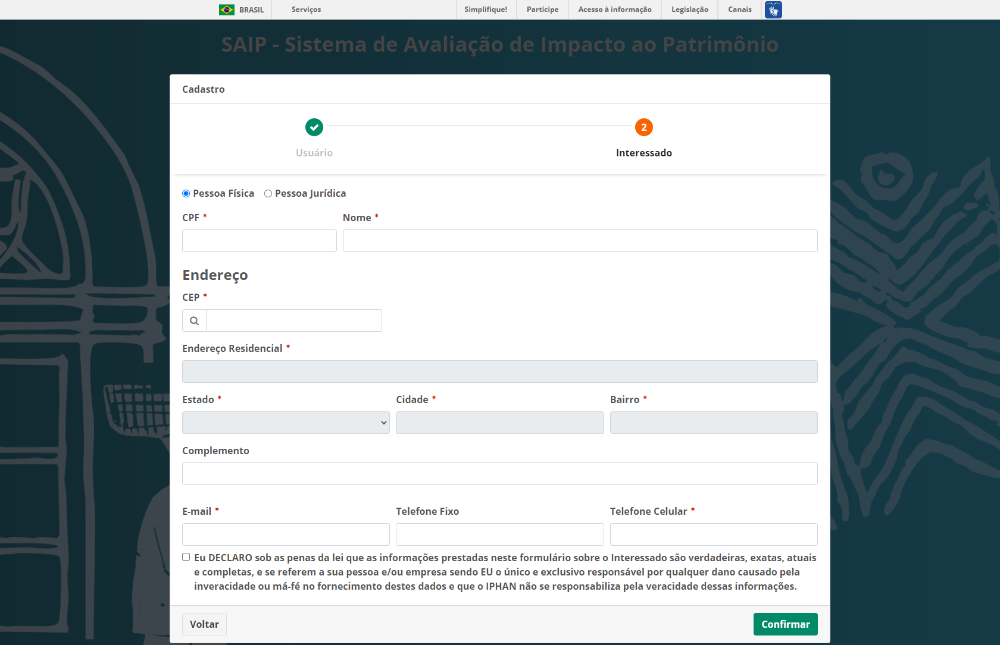
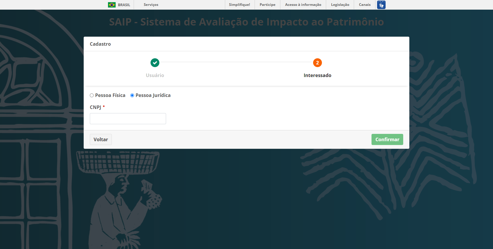
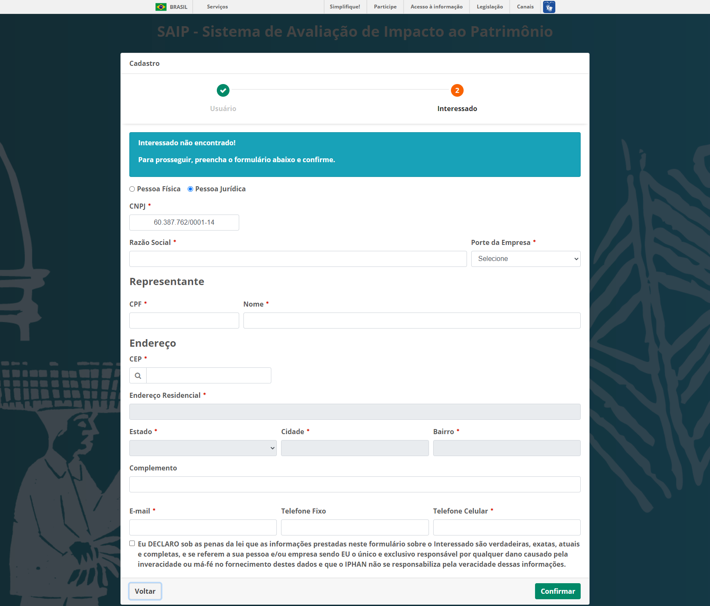

Primeiro Acesso
===========================

.. meta::
   :description: Primeiros passos para acessar o SAIP

Para acessar o sistema SAIP, digite a seguinte URL no navegador: https://www.saip.iphan.gov.br

.. image:: ../images/URL-SAIP.png
   :alt: URL SAIP

Após ser apresentada a tela de login, clique na opção **Acessar com gov.br**.

.. note::

    Caso não possua cadastro no gov.br, clique em **Crie sua conta gov.br**.

Informar Dados Complementares
--------------------------------

Após o seu login utilizando a plataforma **gov.br**, por se tratar do primeiro acesso ao SAIP, deverão ser complementadas algumas informações importantes para o sistema em dois passos.

Usuário
^^^^^^^^^^^^^^^^^^^^^^^^^^^^

Passo 1 - Usuário: informar os seus dados como usuário do sistema, se é consultor ou empreendedor, além de alguns dados pessoais como por exemplo  endereço, e-mail e telefone.

Clique no botão **Avançar** ao terminar o formulário. 

.. note:: 

   O sistema vai carregar o seu nome, CPF e e-mail da plataforma **gov.br** permitindo alterar somente o e-mail, caso necessário.

.. note:: 

   Para pesquisar o seu endereço, insira o CEP correspondente e clique na lupa ao lado esquerdo do campo ou aperte a tecla **Tab** no seu teclado que o sistema automaticamente irá pesquisar o endereço conforme o CEP informado. Caso o sistema não encontre os dados para o respectivo CEP, será permitida a inserção do endereço de forma manual.

Os campos que possuem um asterisco em vermelho (:red:`*`) ao lado são de preenchimento obrigatório. Caso os campos não sejam preenchidos, o sistema vai apresentar uma mensagem informando da obrigatoriedade do preenchimento das informações conforme exemplo abaixo:

Interessado
^^^^^^^^^^^^^^^^^^^^^^^^^^^^

Passo 2 - Interessado: preencher as informações da Empresa ou Pessoa Física interessada em solicitar o Licenciamento Ambiental junto ao IPHAN.
 

Ao escolher se o interessado é Pessoa Física ou Pessoa Jurídica, o sistema gerará um formulário especifico.

Pessoa Física
~~~~~~~~~~~~~~~~~~~~~~~~~~~

Ao selecionar Pessoa Física deverão ser preenchidas as seguintes informações CPF, nome, CEP, complemento, e-mail e telefone. Ao final, concordar com a auto declaração e clicar no botão **Confirmar**.

.. note:: 

   O preenchimento automático acontece se houver o registro na base, ao inserir o CPF.

.. note:: 

   Para pesquisar o seu endereço, insira o CEP correspondente e clique na lupa ao lado esquerdo do campo ou aperte a tecla **Tab** no seu teclado que o sistema irá pesquisar o endereço conforme o CEP informado. Caso o sistema não encontre os dados para o respectivo CEP, será permitida a inserção do endereço de forma manual.
   

Os campos que possuem um asterisco em vermelho (:red:`*`) ao lado são de preenchimento obrigatório. Caso os campos não sejam preenchidos, o sistema apresentará uma mensagem informando da obrigatoriedade do preenchimento das informações conforme exemplo abaixo:

Pessoa Jurídica
~~~~~~~~~~~~~~~~~~~~~~~~~~~

Preencher o CNPJ a ser consultado na base de dados.

Após informar o CNPJ, o sistema apresentará um formulário. Este deverá ser preenchido com a Razão Social, o porte da empresa, o representante, endereço, e-mail e telefone. A auto declaração será apresentada no final. Clique no botão concordar e então no botão **Confirmar**. 

.. note:: 

   Caso o CNPJ esteja cadastrado na base de dados, o preenchimento da razão social será automático. 

.. note:: 

   Para pesquisar o seu endereço, insira o CEP correspondente e clique na lupa ao lado esquerdo do campo ou aperte a tecla **Tab** no seu teclado que o sistema irá pesquisar o endereço conforme o CEP informado. Caso o sistema não encontre os dados para o respectivo CEP será permitida a inserção do endereço de forma manual.

Os campos que possuem um asterisco em vermelho (:red:`*`) ao lado são de preenchimento obrigatório. Caso os campos não sejam preenchidos, o sistema apresentará uma mensagem informando da obrigatoriedade do preenchimento das informações conforme exemplo abaixo: 

