Minhas Solicitações (FCA)
===========================

.. meta::
   :description: Visualizar as solicitações realizadas.

Para acessar as suas solicitações realizadas e acompanha-las pelo SAIP, basta clicar na opção **Minhas Solicitações** no menu lateral esquerdo.

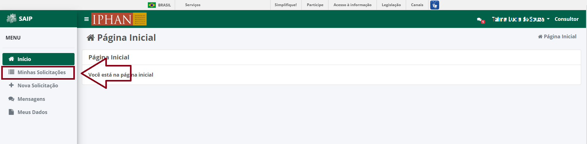

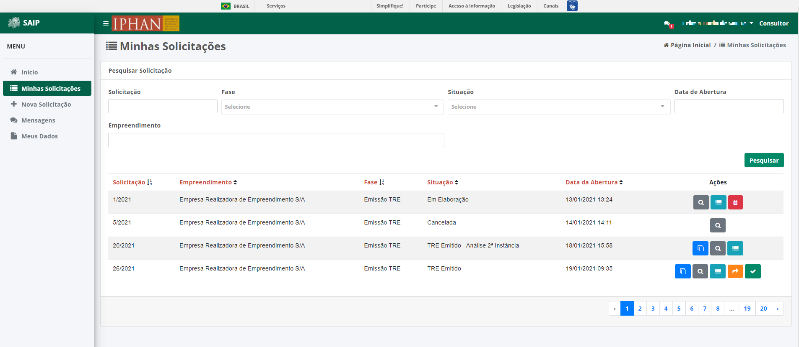

Solicitações
----------------------------

Em **Pesquisar Solicitação**, na parte superior se encontram os filtros de pesquisa como Número da Solicitação, Fase, Situação, Data de Abertura e Empreendimento.

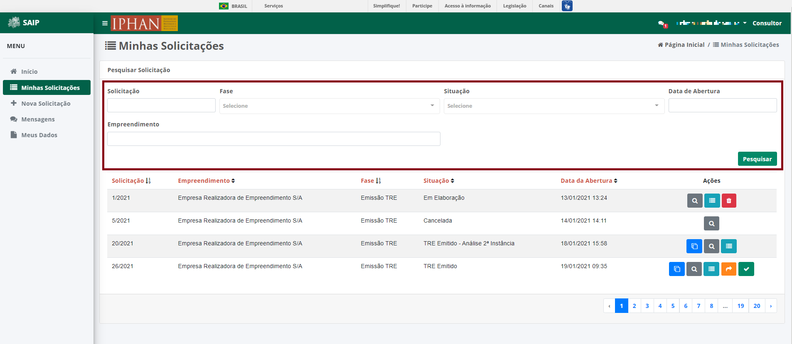

.. note:: 
    Sempre que ao preencher os filtros, não esqueça de acionar o botão **Pesquisar**, para que surja efeito no sistema.

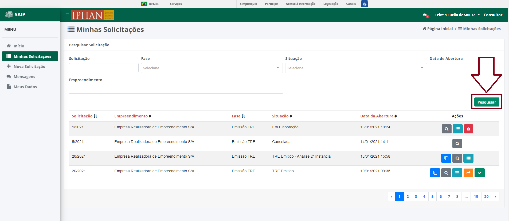

Em **Pesquisar Solicitação**, na parte inferior se encontra os registros totais de solicitações ou o resultado da pesquisa realizada com os filtros. As colunas apresentadas são Solicitação, Empreendimento, Fase, Situação, Data de Abertura e Ações.

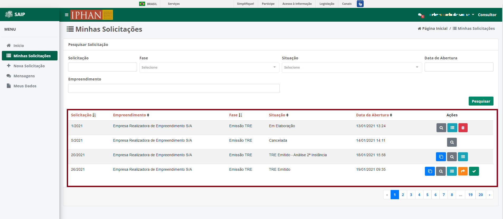

.. note:: 
    O sistema permite que você ordene as colunas por ordem crescente ou decrescente conforme se clica nos títulos de cada coluna.

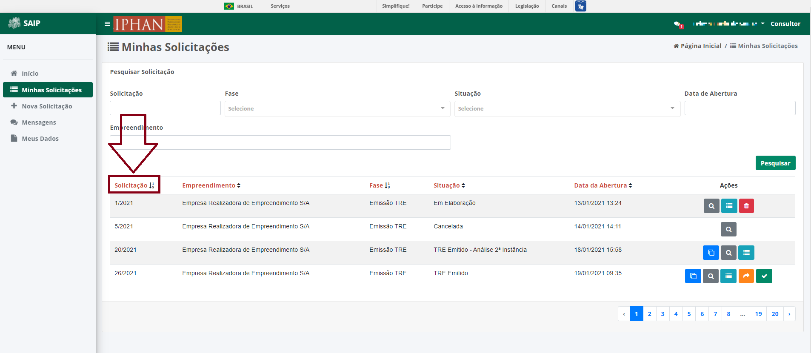

.. note:: 
    Na lista de solicitações, o sistema apresenta a paginação a cada 10 registros, onde é possível selecionar a página e nas extremidades há a ação de página anterior e próxima página.

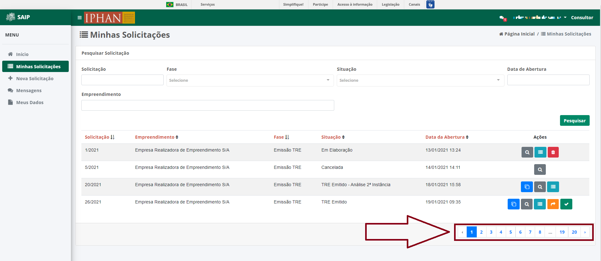

Na lista, há as ações de **Clonar Solicitação**, **Visualizar Solicitação**, **Detalhar Solicitação**, **Encaminhar para a Instância Recursal**, **Concordo com o TRE analisado manualmente** e **Excluir Solicitação**, respectivamente.

.. note:: 
    As ações são apresentadas conforme a **Situação** atual da solicitação.

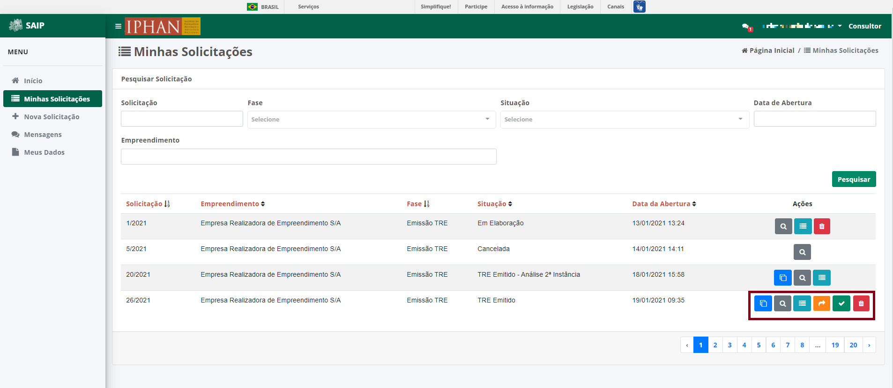

Clonar Solicitação
----------------------------

Ao acionar o botão **Clonar Solicitação**, o sistema irá clonar a respectiva solicitação e informar o número da nova solicitação.

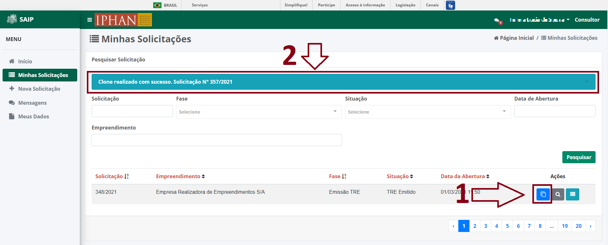

Visualizar Solicitação
----------------------------

Ao acionar o botão **Visualizar Solicitação**, o sistema apresentará uma janela com os dados da solicitação separados por passo. Será apresentado o botão **Fechar** que ao ser acionado irá fechar a janela de visualização da solicitação.

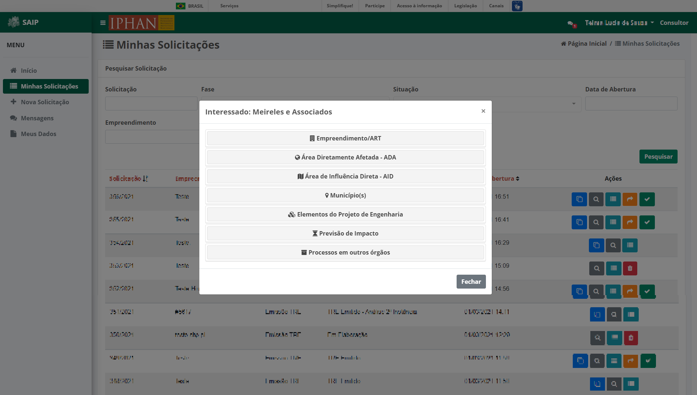

Detalhar Solicitação
----------------------------

Ao acionar o botão **Detalhar Solicitação**, o sistema apresentará uma janela com o número da solicitação, número do SEI, progresso atual do preenchimento da solicitação, a situação da solicitação e os arquivos anexados na solicitação ou gerados pelo sistema para a solicitação. Serão apresentados os botões **Fechar**, **Encaminhar para a Instância Recursal** e **Concordo com o TRE analisado manualmente** que ao ser acionado respectivamente, irá fechar a janela de detalhamento da solicitação, encaminhar a solicitação para a instância recursal e concordar com o TRE gerado na análise manual.

.. note:: 
    As ações **Encaminhar para a Instância Recursal** e **Concordo com o TRE analisado manualmente** são apresentadas conforme a **Situação** atual da solicitação.

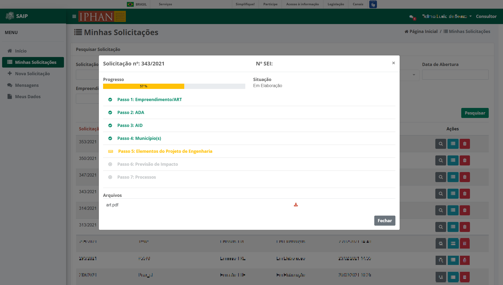

Encaminhar para a Instância Recursal
----------------------------------------

Em caso de sua solicitação ter sido enviada para análise manual, no seu retorno com um TRE gerado, o sistema permitirá que se encaminhe a solicitação para Instância Recursal. O sistema apresenta as opções na lista de solicitações e no detalhamento da solicitação.

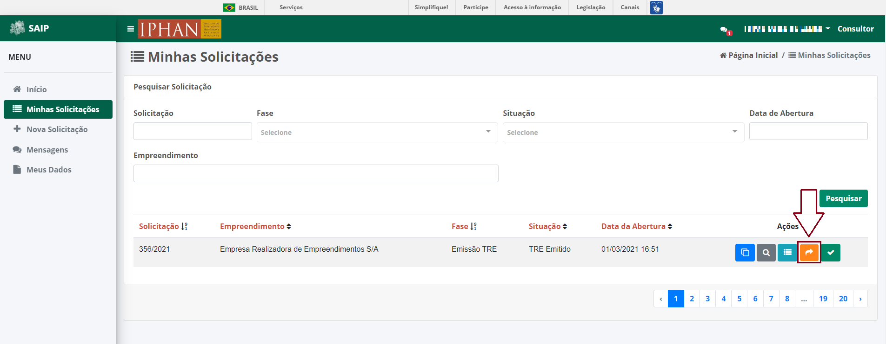

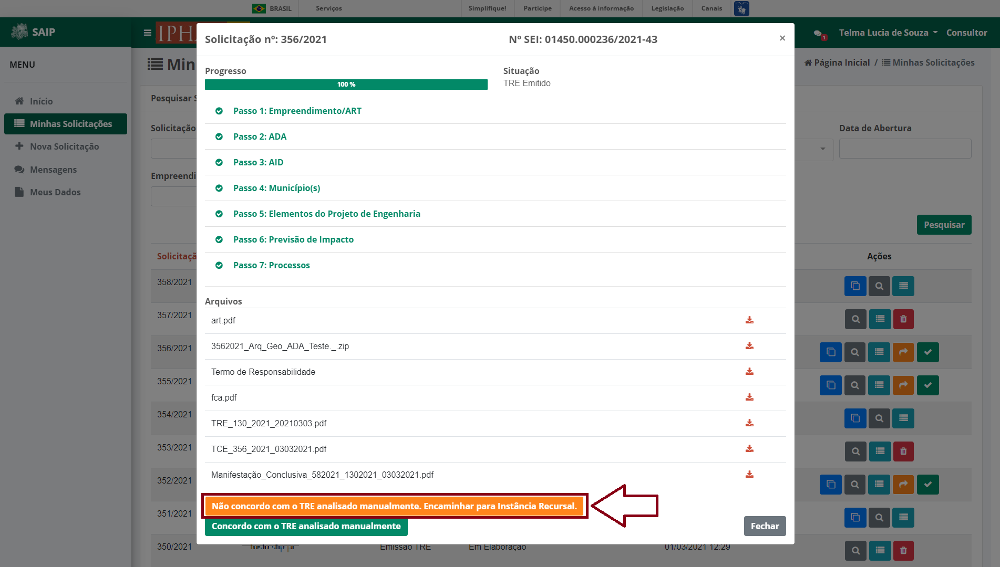
   

Ao acionar o botão **Não concordo com o TRE analisado manualmente. Encaminhar para Instância Recursal**, o sistema irá apresentar uma janela de confirmação e então acione o botão **Não concordo com o TRE analisado manualmente. Encaminhar para Instância Recursal** para então encaminhar a sua solicitação a uma segunda instância de análise por parte do IPHAN.

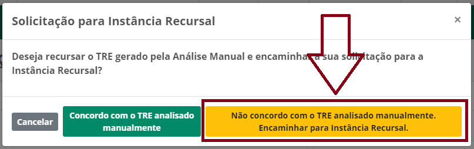

Caso deseje concordar com o TRE gerado, acione o botão **Concordo com o TRE analisado manualmente**. Ao aciona-lo, o sistema irá entender a sua concordância e irá remover a opção de solicitar a instância recursal.

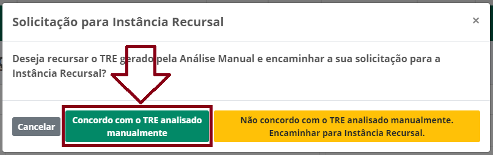

Concordo com o TRE analisado manualmente
-----------------------------------------

Em caso de sua solicitação ter sido enviada para análise manual, no seu retorno com um TRE gerado, o sistema permitirá que se concorde com o TRE gerado pela análise manual. O sistema apresenta as opções na lista de solicitações e no detalhamento da solicitação.

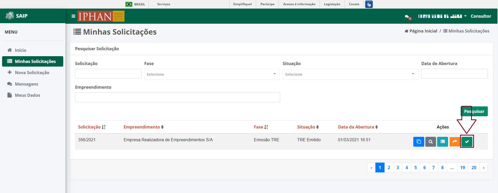

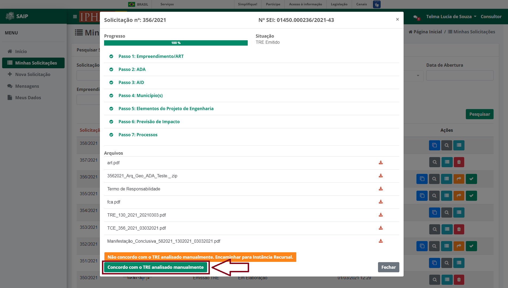

Ao acionar o botão **Concordo com o TRE analisado manualmente**, o sistema irá entender a sua concordância e irá remover a opção de solicitar a instância recursal.

Excluir Solicitação
----------------------------

Ao acionar o botão **Excluir Solicitação**, o sistema apresentará uma janela de confirmação da exclusão. Serão apresentados os botões **Cancelar** e **Ok** aonde respectivamente um realiza o fechamento da mensagem e o outro confirma a exclusão da solicitação.

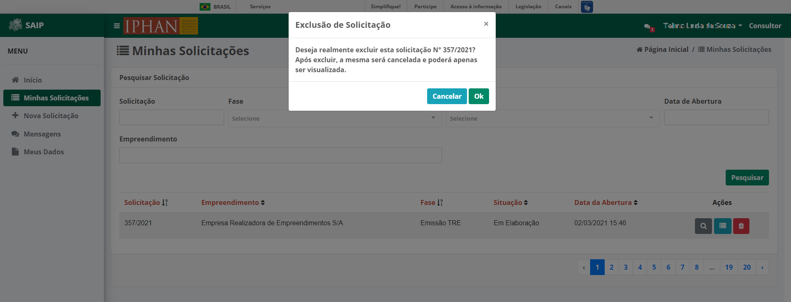

.. note:: 
   Ao excluir uma solicitação, o sistema irá modificar a situação para **Cancelada**, podendo apenas os dados serem visualizados.
